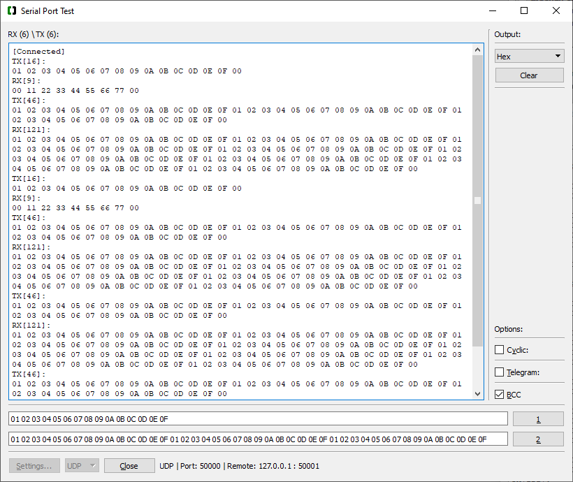

# QtSerialPortTest

Qt application for sending and receiving data via COM port and UDP telegrams.

QtSerialPortTest is a C++ application written in Qt that allows easy sending and receiving of raw data via COM port or UDP telegrams.

It offers the following functionality:
- send raw-data in hexadecimal format.
- receive and display raw-data in hexadecial format (TBD: other formats to be added).
- display sent and received data separately or mixed.
- send/receive data via COM-Port.
- send/receive UDP-Telegrams.
- up to 5 separate fields for send-data (Buttons 1..5, configured in Settings).
- send data cyclically (only Button 1)
- send telegrams with the following format:
    - destination address (1 byte)
    - source address (1 byte)
    - function (1 byte)
    - length (1 byte)
    - payload (up to 256 bytes)
    - xor checksum (1 byte)
- append 1 byte xor checksum to the raw-data to be send (BCC checkbox)

## How to compile QtSerialPortTest

QtSerialPortTest was created in Qt5 + Microsoft Visual C

## How to run QtSerialPortTest

Windows: download the `bin/QtSerialPortTest.exe` and execute it.
(MD5 Checksum: 428a96669c4a70ed1cce4416c5d2eedf)
